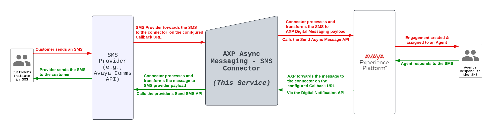

# Avaya Experience Platform - SMS Connector

This sample SMS Connector integrates the SMS channel into the Avaya Experience Platform (AXP) using its Digital Custom Messaging Capabilities and Async APIs.

## :warning: **Disclaimer**

> :bulb: This sample application is provided **for demonstration purposes only** and is not intended for production use. We assume no responsibility for any issues arising from its use.

---

## Description

The connector leverages Avaya Experience Platform's Custom Messaging Digital APIs & Digital Notification APIs to seamlessly send and receive messages to/from AXP.

### Supported SMS Providers
- **Avaya Communications API**: Uses Avaya Comms APIs' SMS functionalities.
- More providers coming soon!

### Key Functionalities
1. **API for Callback from AXP** (Agent to SMS Customer):
   - Default endpoint: `{{APP_BASE_URL}}/{{APP_BASE_ROUTE}}/axp/providers/:providerType/callback`
   - Example for Avaya Comms API: `https://my.server.com/v1/api/axp/providers/cpaas/callback`

2. **API for Callback from SMS Provider** (SMS Customer to Agent):
   - Supported provider: **Avaya Communications API**
   - Default endpoint: `{{APP_BASE_URL}}/{{APP_BASE_ROUTE}}/cpaas/numbers/:inboundSMSNumber/callback`
   - Example: `https://my.server.com/v1/api/cpaas/numbers/123456789/callback`

## Flow Diagram


## Technical Guide

### Service Configuration
Configure the service using the `.env` file or the `docker-compose.yml` file. Here are the key variables:

#### Main Configuration
```sh
APP_NAME=axp-cpaas-sms-connector
APP_BASE_ROUTE=/v0/api
APP_BASE_URL=http://localhost
PORT=3030
```

#### Logging Configuration
```sh
LOG_LEVEL=info
LOG_TO_CONSOLE=true
LOG_OUTGOING_REQUESTS=true
```

## Pre-requisite Configuration

### Avaya Experience Platform Configuration

As a prerequisite to using any Avaya Experience Platform API, you need to have API Access Provisioned **`(Client Id & Client Secret & AppKey)`**. You also must have the Digital Bundle from Avaya Experience Platform to use this service.

#### Provisioning the Integration

You need to provision two items on the AXP Admin Portal:

**Digital Messaging Connector Provider** **`[Channel Provider Id]`**
- On the AXP Admin Portal, go to - Element Inventory → Create New → Digital Connector → Messaging.
- Fill in the Display Name as you'd like (e.g., SMS Provider).
- After creating that, you will be able to see the `Channel Provider Id`, which will be required as part of the configuration for this service.

**Digital Custom Messaging Integration** **`[Integration Id]`**
- On the AXP Admin Portal, go to - Channels → Messaging → Select Integration Type `Custom Messaging` → Select the provider you created in the above step → Create Integration.
- Fill in the Display Name as required (e.g., SMS Integration).
- After creating that, you will be able to see the `Integration Id`, which will be required as part of the configuration for this service.

#### Configuring the Webhook Callback Subscription
In order to start receiving the AXP Messages sent by agents, you need to create a Digital Notification Subscription using the Digital Notification API.

The request should be done externally (not within this service) prior to running this connector.

```bash
curl --location 'https://{region}.api.avayacloud.com/api/digital/webhook/v1/accounts/{you-axp-account-id}/subscriptions' \
--header 'Content-Type: application/json' \
--header 'Authorization: Bearer {axp-client-credentials-token}' \
--header 'appkey: {your-axp-applicaiton-key}'
--data '{
  "channelProviderId": "The Channel Provider Id configured in the past few steps, for example, 0d2xxxx9a-1bx6-xx1c-xxxe-8fa2b5xxxxx",
  "callbackUrl": "The callback URL for this service, for example, https://my.server.com/v1/api/axp/providers/cpaas/callback",
  "eventTypes": [
    "CC_MESSAGES"
  ]
}'
# Note: For this use-case, the eventTypes should always only be CC_MESSAGES, this is to only receive the messages sent by the Agents & AXP Automation and not be flooded with every single message sent or received.
```

Once the above steps are done, you have configured the AXP callback part of this service, and you should have the following variables to update in the .env file (or the docker-compose.yml file)

```bash
AXP_BASE_URL=https://{region}.cc.avayacloud.com
AXP_ACCOUNT_ID=ABCDEF
AXP_CLIENT_ID=CLIENT_ID
AXP_CLIENT_SECRET=CLIENT_SECRET
AXP_DIGITAL_API_VERSION=v1beta
AXP_INTEGRATION_ID=INTEGRATION_ID
AXP_PROVIDER_ID=PROVIDER_ID
```

### Avaya Communications APIs Configuration

You must have a Phone Number on Avaya Communication APIs with SMS enabled.

#### Provisioning the Integration

You need the following credentials from Avaya Communications API to able to use this service:
- Account SID
- Auth Token

To get these credentials, go to your Avaya Communications APIs Administration Portal, go to Accounts → Overview. You should see a Credentials section with the Account SID and Auth Token visible.


#### Configuring the Webhook Callback Subscription

To configure the Webhook Callback for the Phone Number you want to use for inbound SMS processing, go to your Avaya Communications APIs Administration Portal:
- Navigate to the `Numbers` tab.
- Click on the Phone Number with SMS enabled that you want to use.
- As part of the SMS configuration section, Select Configure with `Webhooks` → Request URL should be `Weblink`
- The callback URL should be added as the endpoint exposed byt this service, for example, https://my.server.com/v1/api/cpaas/numbers/123456789/callback
- NOTE: replace the `123456789` path parameter of the callback URL with the phone number you chose, without any whitespace and without the + sign.


Once the above steps are done, you have configured the Avaya Comms API callback part of this service, and you should update the following variables in the .env file (or the docker-compose.yml file):

```bash
CPAAS_BASE_URL=https://{region}.cpaas.avayacloud.com/v2
CPAAS_ACCOUNT_SID=ACCOUNT_SID
CPAAS_AUTH_TOKEN=AUTH_TOKEN
```

## Build & Deployment Guide


You can run this service in two modes, either native mode or using docker.

### Native Build

- NodeJS v18.0+ is a prerequisite.
- Update the `.env` file with the required variables prior to running the service.

- Run `npm install` _somtimes adding `--force` as an option helps :)_
- Run `npm run dev` for _dev_ mode or `npm run start` for a _built_ mode.


### Docker build (recommended)

- Docker & Docker Compose are prerequisites.
- For running in _dev_ mode
  - You must update the `.env` file with the required variables prior to continuing.
  - run `docker-compose up -f docker-compose-dev.yml --build`
- For running in _built_ mode
  - You must update the `docker-compose.yml` file with the environment variables and ports to expose on the docker network.
  - run `docker-compose up --build`

  Note: The service will now run in a non-secure HTTP mode, you must use a proxy or something similar to expose it as HTTPS as the callbacks for both AXP and Comms API only support HTTPs.
